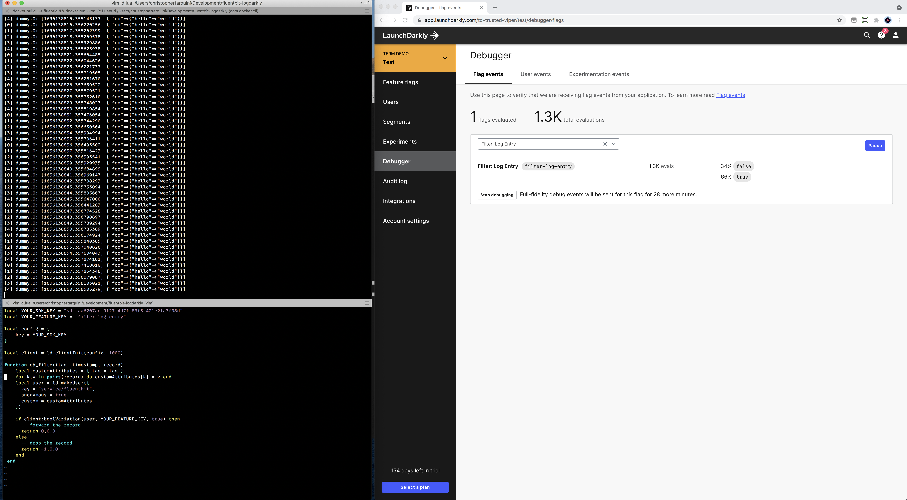

# Fluentbit LaunchDarkly Filter



## Overview

This is a minimal proof-of-concept demonstrating the ability to forward or drop log entries using in [Fluentbit](https://fluentbit.io/) using the [LaunchDarkly Lua SDK](https://docs.launchdarkly.com/sdk/server-side/lua).

Please be advised that the author:

- 🤷🏽‍♂️ Has never written Lua before
- ⚠️ Has never used Fluentbit in production 
- ⏱ Only spent a couple hours on this 

**Quality:** ✨ Works on my machine  ✨

## Building the image


```sh
docker build . -t fluentld
```

## Running the container

```sh
docker run --rm -it fluentld -e LD_SDK_KEY=YOUR-SDK-KEY -e LD_LOG_LEVEL=WARN 
```

## Configuration

`ld.lua` contains the lua filter used that initializes the SDK and evaluates the `filter-log-entry` flag for each entry. If it returns true, the record is kept, if it returns false, it is dropped

`fluentbit.conf` is the configuration for fluentbit where the filter is configured with a `dummy` input and `stdout` output.


See the dockerfile for steps to build the Lua SDK and it's dependencies. 
